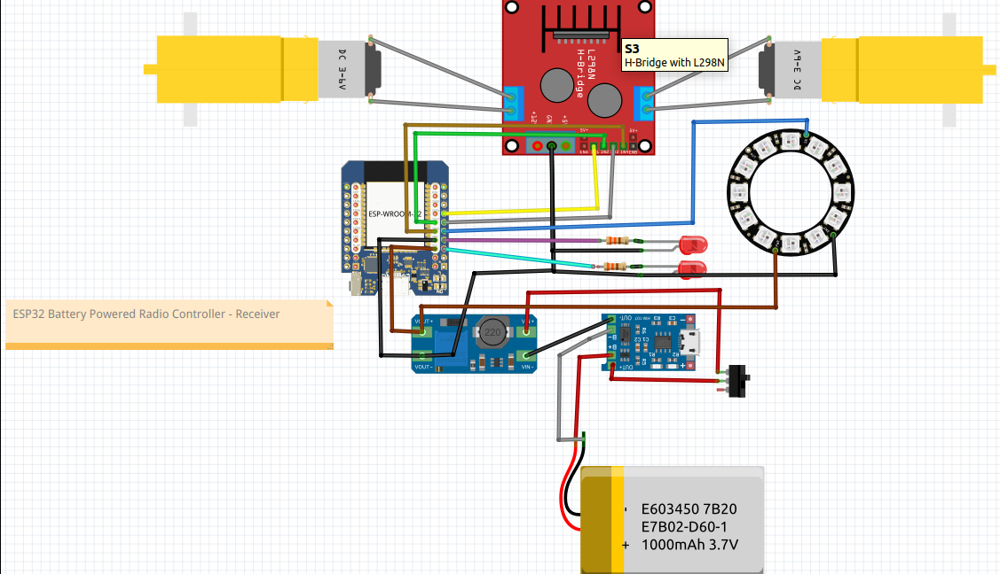
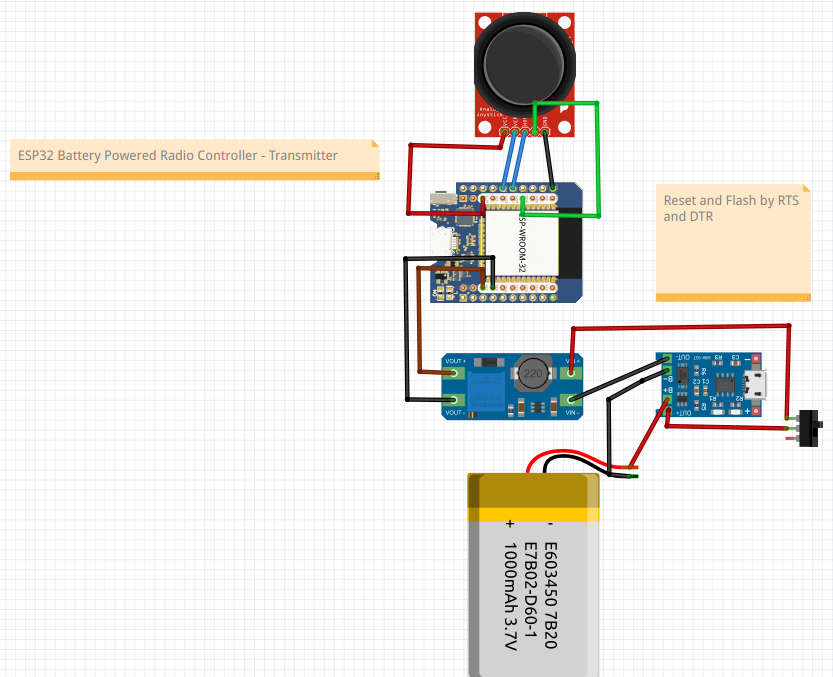

# ESP32 Radio Controller for my Cardboard Robot
An RC transmitter and receiver using two ESP32, based on ESPNOW

The hardware projext is here [https://hackaday.io/project/194108-a-cardboard-robot](https://hackaday.io/project/194108-a-cardboard-robot)

### Overview
The Transmitter encodes the position of the joystick and sends it via [ESPNOW](https://randomnerdtutorials.com/esp-now-esp32-arduino-ide/) protocol to the Receiver.

The Receiver: 
* decodes the position of the joystick and activate the two motors properly: Forward Backward Left Right
* generates different light patterns on the 12 LEDs ring (rainbow and similars) and on the two LED eyes.

### Receiver schematic

### Transmitter schematic

### Folders

* The [ESP32-espnow-cardboard-robot-rx](https://github.com/guido57/ESP32-cardboard-robot/tree/main/ESP32-espnow-cardboard-robot-rx) folder contains the Platorm IO code for the receiver
* The [ESP32-espnow-cardboard-robot-tx](https://github.com/guido57/ESP32-cardboard-robot/tree/main/ESP32-espnow-cardboard-robot-tx) folder contains the Platorm IO code for the trnasmitter
  

